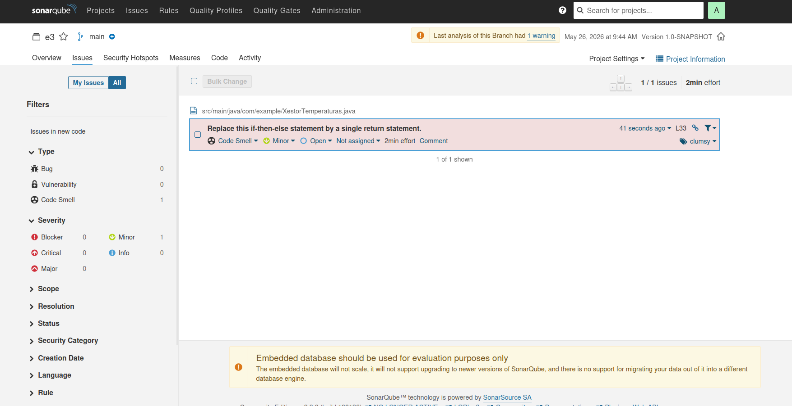
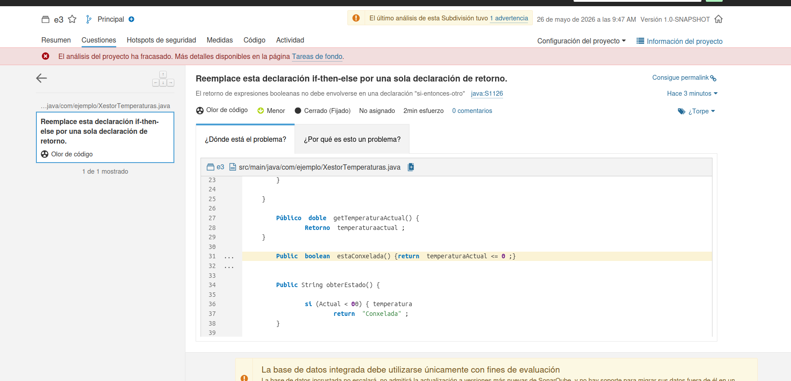
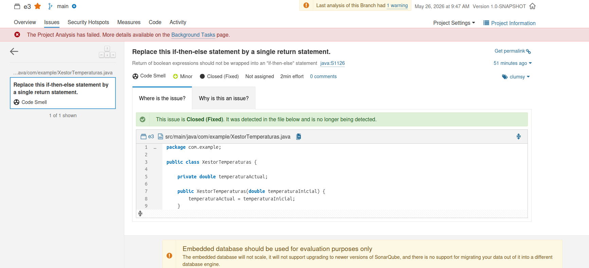
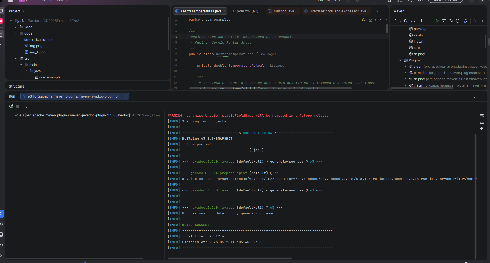
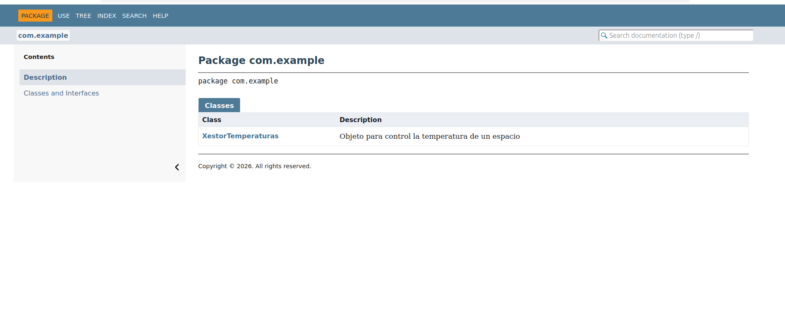
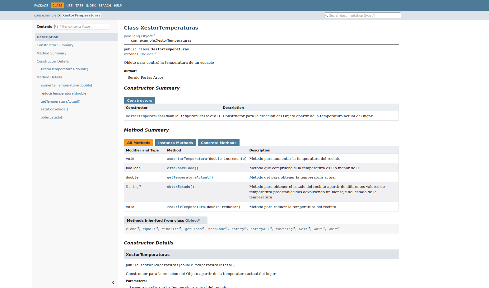

# Exercicio 3: SonarQube

## 2. Captura os issues antes de arreglar nada.

## 3. Resolve os issues.

## 4. Documenta a clase correctamente.

## - Captura da **web** coa documentación creada con javadoc.

