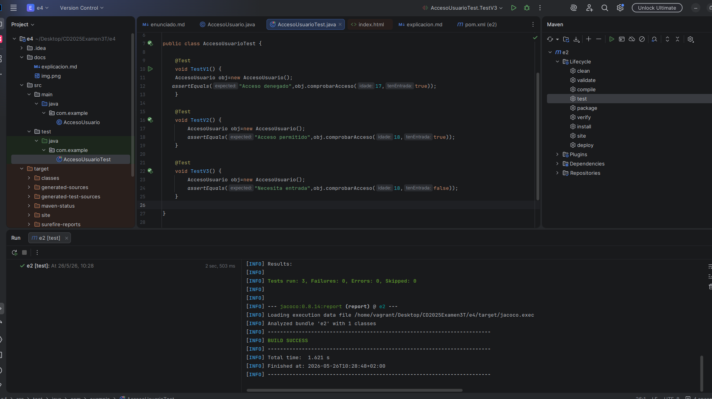
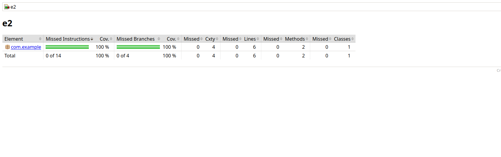
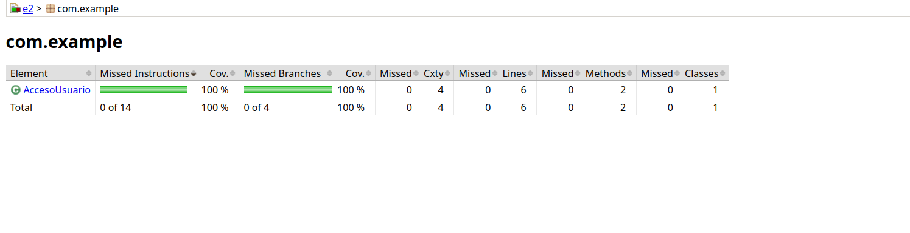

# Exercicio 4: Complexidade ciclomática

## 1. Utiliza unha das fórmulas para calcular a complexidade ciclomática.

    Al contar con un metodo ya solo por existir se cuenta ya +1, en total cuenta con una complejidad ciclomatica de 3 ya que cuenta con dos nodos un if y el otro else.
    

    V(G) = c + 1
    V(G) = 2 + 1(3)
### puedase ver:

public String comprobarAcceso(int idade, boolean tenEntrada) {

                                -- 1  

        if (idade >= 18) {  -- 2
 
          if (tenEntrada) {  
             return "Acceso permitido";
           } else {   
               return "Necesita entrada";
           }

       } else {  -- 3

            return "Acceso denegado";

       }

    }

## 2. Diseña tantas probas como che indique a complexidade ciclomática.

## Captura da cobertura do 100%

